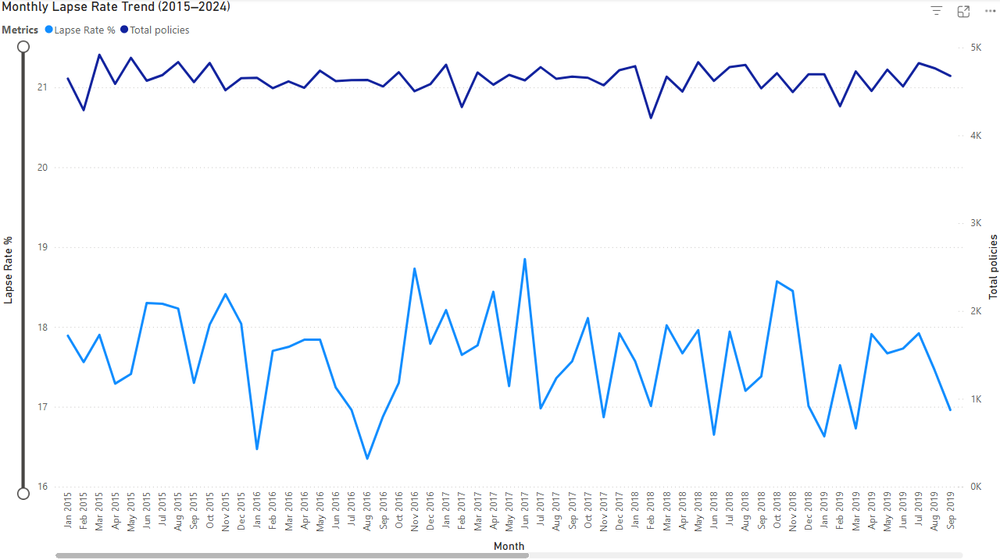
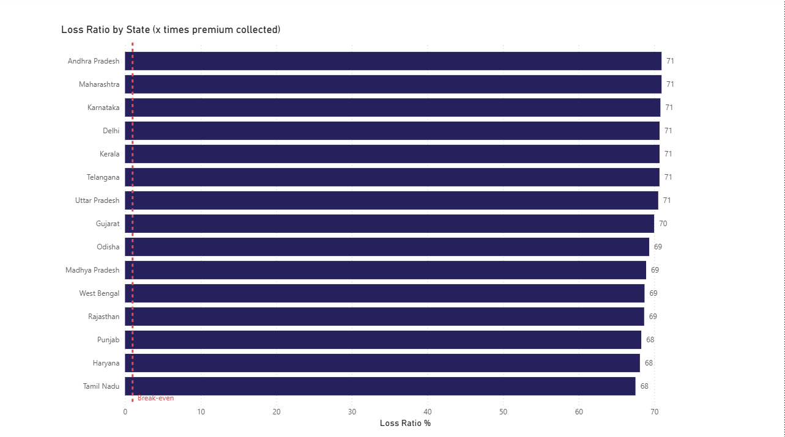
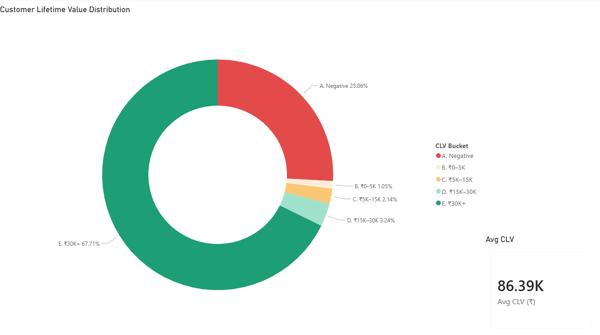
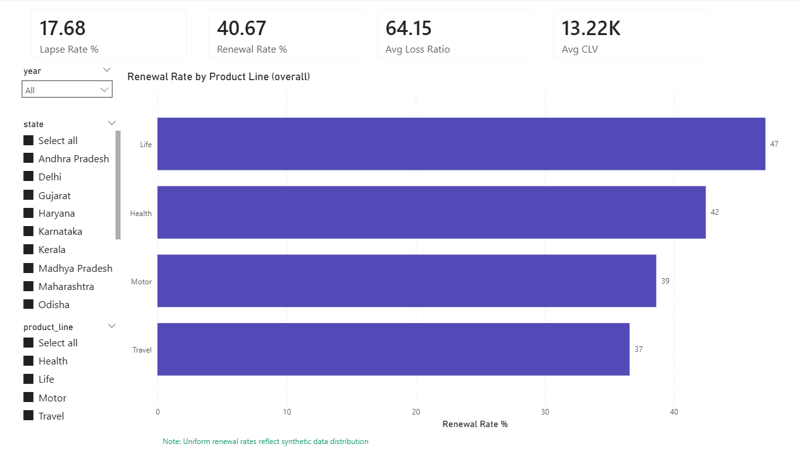
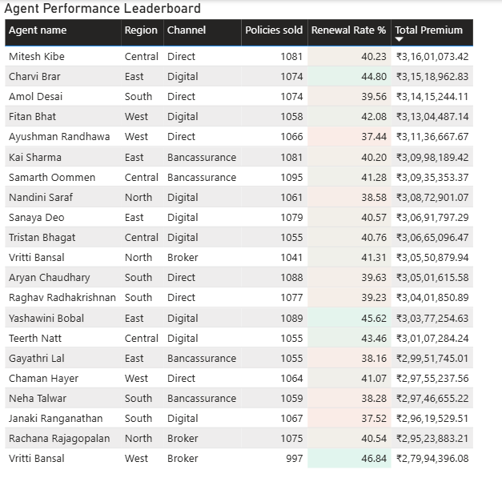
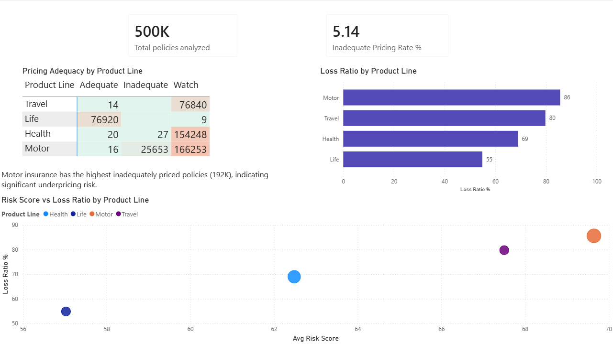
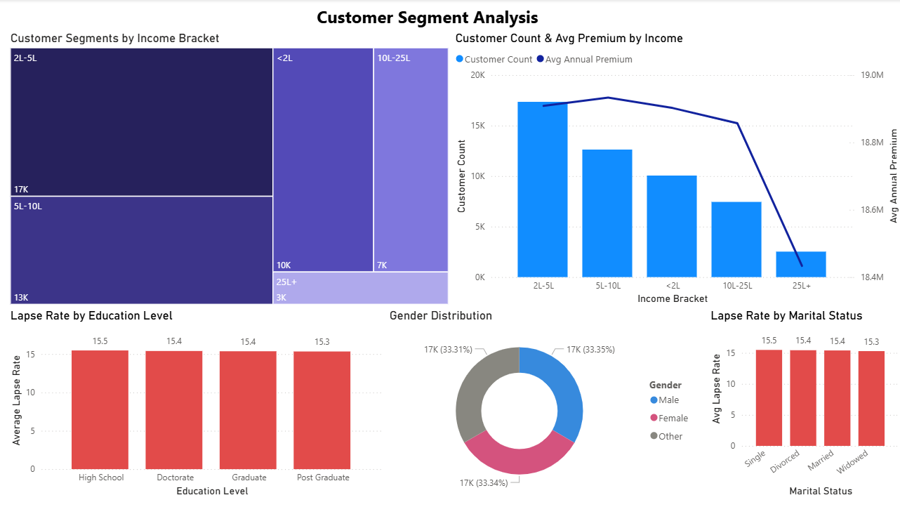

# Insurance Policy Lifecycle Analysis

   

> End-to-end data analytics project analyzing 3.6M rows of insurance policy data across the full policy lifecycle — from acquisition to lapse, renewal, and claims settlement.

---

## Project Overview

I spent 4 years at Cognizant working on insurance data - claims performance dashboards, SLA tracking, loss ratio reporting for BFSI clients. This project is my attempt to build the kind of analysis I was doing at work, end-to-end, from scratch, without a team or existing infrastructure.

The goal was to answer questions a Head of Analytics at a non-life insurer would actually care about - lapse drivers, pricing adequacy, CLV by segment, agent productivity. Not just "here's a dashboard," but here's what the data says and what you should do about it.
Domain: Insurance (Non-Life) | Scale: 3.6M rows, 8 tables | Timeline: 5 days

---

## Business Questions Answered

| # | Business Question | Insight |
|---|---|---|
| 1 | What is the policy lapse rate trend over time? | Stable 17.7% lapse rate across 2015–2024, driven by income and risk profile |
| 2 | Which states have the highest loss ratios? | 68–71% range across all states — within IRDAI benchmark of 70–110% |
| 3 | What does the CLV distribution look like? | 74% positive CLV, 26% negative — avg ₹86K |
| 4 | Which product lines renew best? | Life 47%, Health 42%, Motor 39%, Travel 37% |
| 5 | Who are the top performing agents? | Top agents sell 1,050–1,095 policies with ₹3.1Cr+ premium written |
| 6 | Is pricing adequate across product lines? | Motor highest loss ratio at 86%, Life lowest at 55% |
| 7 | How are customers segmented by demographics? | 2L–5L income bracket dominates (17K customers); lapse rate decreases monotonically with income |

---

## Tech Stack

| Layer | Technology |
|---|---|
| Data Generation | Python (Faker, pandas, numpy) |
| Database | PostgreSQL 18 |
| SQL Analytics | 7 PostgreSQL views with pre-aggregation CTEs |
| Visualization | Power BI Desktop (7 pages, Import mode) |
| DAX | 5 calculated measures |
| Machine Learning | scikit-learn (KMeans, Logistic Regression, Random Forest, Linear Regression) |
| Version Control | Git + GitHub |
| IDE | VS Code + SQLTools |

---

## Architecture

```
Python (Faker + pandas)
        ↓
  Synthetic data generation
  (500K policies, 50K customers,
   500 agents, 2.7M premiums)
        ↓
  PostgreSQL 18
  (star schema, 8 tables, 3.6M rows)
        ↓
  7 PostgreSQL views
  (pre-aggregated analytics layer)
        ↓
  Power BI Desktop (Import mode)
  (7 pages, 5 DAX measures, cross-page slicers)
        ↓
  Python ML Notebook
  (KMeans, Logistic Regression, Random Forest,
   Linear Regression)
```

---

## Database Schema

| Table | Rows | Description |
|---|---|---|
| dim_date | 3,653 | Date dimension (2015–2024) |
| dim_customers | 50,000 | Customer demographics |
| dim_agents | 500 | Agent and channel info |
| dim_products | 13 | Product catalog |
| fact_policies | 500,000 | Policy lifecycle events |
| fact_premiums | 2,787,821 | Premium payment records |
| fact_claims | 263,750 | Claims and settlements |
| fact_renewals | 273,107 | Renewal events and CLV |

### Relationships (Star Schema)
```
dim_customers ──→ fact_policies ←── dim_products
dim_agents    ──→ fact_policies ←── dim_date
                       ↓
              fact_claims
              fact_premiums
              fact_renewals
```

---

## PostgreSQL Views

All 7 views use pre-aggregated CTEs to eliminate fan-out join errors - a common issue when joining multiple fact tables to a single policy record.

| View | Purpose |
|---|---|
| vw_lapse_trend | Monthly lapse rate % and policy count 2015–2024 |
| vw_loss_ratio_state | Loss ratio by state using correct separate-aggregate method |
| vw_clv | Customer lifetime value estimates per customer |
| vw_renewal_behavior | Renewal rates and premium change by product line |
| vw_pricing_adequacy | Pricing status by product line and year |
| vw_agent_performance | Agent KPIs - policies sold, renewal rate, lapse rate, premium |
| vw_customer_segments | Customer segmentation by income, gender, education, marital status |

---

## Power BI Dashboard

7-page interactive dashboard with slicers (Year, State, Product Line) synced across pages.

> 📊 **[Download Power BI Dashboard (.pbix)](https://drive.google.com/file/d/1rVKOPWMcvml6o1ZnCWt7i1wANQRfDP22/view?usp=drive_link)**
> *(198MB — hosted on Google Drive due to GitHub's 100MB file size limit)*

### Page 1 — Lapse Trend

Monthly lapse rate trend 2015-2024 with total policies overlay. Rate fluctuates 16-19%, averaging 17.7%.

### Page 2 — Loss Ratio by State

Horizontal bar chart showing loss ratio per state with break-even reference line. Range: 68–71% across all 15 states.

### Page 3 — CLV Distribution

Donut chart - 25.86% negative CLV, 67.71% above ₹30K. Avg CLV ₹86.39K.

### Page 4 — Overview

KPI cards: Lapse Rate 17.68%, Renewal Rate 40.67%, Avg Loss Ratio 64.15, Avg CLV ₹13.22K. Renewal rate by product line bar chart.

### Page 5 — Agent Performance Leaderboard

Top 20 agents by total premium written with conditional formatting on renewal rate. Top agent: Mitesh Kibe, ₹3.16Cr, 40.23% renewal.

### Page 6 — Pricing Adequacy

Pricing adequacy matrix + loss ratio by product line + risk score vs loss ratio scatter. Motor highest at 86%, Life lowest at 55%.

### Page 7 — Customer Segmentation

Income treemap + customer count by income + lapse rate by education/marital status + gender distribution.

---

## DAX Measures

```dax
Lapse Rate % =
DIVIDE(
    CALCULATE(COUNTROWS('public fact_policies'),
    'public fact_policies'[is_lapsed] = TRUE()),
    COUNTROWS('public fact_policies')
) * 100

Renewal Rate % =
DIVIDE(
    CALCULATE(COUNTROWS('public fact_renewals'),
    'public fact_renewals'[renewed] = TRUE()),
    COUNTROWS('public fact_renewals')
) * 100

Avg Loss Ratio =
DIVIDE(
    SUM('public fact_claims'[approved_amount]),
    SUM('public fact_premiums'[amount_paid])
) * 100

Avg CLV = AVERAGE('public fact_renewals'[clv_at_renewal])

Inadequate Pricing Rate % =
DIVIDE(
    CALCULATE(SUM('public vw_pricing_adequacy'[policy_count]),
    'public vw_pricing_adequacy'[pricing_status] = "Inadequate"),
    SUM('public vw_pricing_adequacy'[policy_count])
) * 100
```

---

## ML Analysis

**Script:** `notebooks/05_ml_analysis_v2.py`

### Results Summary

| Technique | Purpose | Result |
|---|---|---|
| KMeans (K=4) | Customer segmentation | Silhouette score: 0.1944 - 4 segments by risk/tenure |
| Logistic Regression | Lapse prediction | ROC-AUC: **0.6484** - 62% recall on lapsed policies |
| Random Forest | Lapse prediction | ROC-AUC: **0.6642** - top feature: income bracket |
| Linear Regression | CLV prediction | R²: **0.2106**, MAE: ₹32,927 |

### Model Selection Rationale

Why these models for these questions:

Lapse Prediction → Classification problem (binary outcome)
  - Logistic Regression chosen first: interpretable coefficients 
    tell us which features drive lapse directly actionable 
    for retention teams. Coefficient on income_enc = -312 means 
    higher income bracket = lower lapse probability.
  - Random Forest added: captures non-linear interactions 
    (e.g. high risk score + low income = disproportionately 
    high lapse) that LR misses. RF AUC 0.6642 > LR 0.6484 
    confirms non-linearity exists.
  - I did NOT use XGBoost or neural networks as it is unnecessary 
    complexity for a 6-feature model with 500K rows where 
    interpretability matters more than marginal AUC gains.

Customer Segmentation → KMeans chosen over DBSCAN/hierarchical
  - KMeans: business needs a fixed number of actionable segments 
    (4 = Low Risk, High Value, At Risk, Mid Tier). 
  - DBSCAN would find arbitrary shapes but give variable K that is 
    unusable for a business team that needs stable segments.
  - Silhouette score 0.19 is low but expected as insurance 
    customers don't form hard clusters. Directional value remains.

CLV Prediction → Linear Regression chosen over tree models
  - CLV is a continuous outcome with a known economic formula. 
    Linear Regression gives interpretable coefficients i.e
    policy_tenure_months coefficient of 2,213 means each 
    additional month of tenure adds ₹2,213 to predicted CLV. 
    Directly usable by pricing teams.
  - R² of 0.21 is honest as stochastic claims events dominate 
    CLV variance. A Random Forest would overfit to training 
    data and give false confidence. Linear Regression 
    is the right tool for an explainable baseline.


### Model Notes

**Lapse Prediction:** Both models significantly outperform random baseline (AUC 0.50). Logistic Regression uses `class_weight='balanced'` to handle the 18%/82% class imbalance. Random Forest constrained with `max_depth=10` and `min_samples_leaf=50` to prevent overfitting. Top predictive feature: `income_enc` — confirming that affordability is the primary lapse driver.

**CLV Regression:** R² of 0.21 is expected. CLV is primarily driven by stochastic claims events which are not predictable from demographics alone. The model captures the structural component (tenure, risk score, product line) explaining ~21% of variance, consistent with actuarial literature on demographic CLV models.

**KMeans:** Silhouette score of 0.19 reflects soft cluster boundaries as realistic in insurance where customers don't segment sharply. Cluster 3 clearly separates on tenure (32 months vs 14–15 months for others), indicating a committed long-tenure segment.

### Charts Generated (reports/v2_calibrated/)

| File | Description |
|---|---|
| 06_policy_distributions.png | Premium, risk score, tenure distributions |
| 07_lapse_by_income.png | Lapse rate by income bracket (29.3% → 5.5%) |
| 09_clv_analysis.png | CLV distribution histogram + segment pie |
| 10_elbow_silhouette.png | Elbow method + silhouette score for K selection |
| 11_kmeans_clusters.png | Customer cluster scatter + size bar chart |
| 12_lapse_prediction.png | ROC curves (LR vs RF) + feature importance |
| 14_clv_regression.png | Actual vs predicted CLV + regression coefficients |

---

## Key Findings

### 1. Lapse Rate
- **17.7%** overall lapse rate, stable across 2015–2024
- Lapse rate decreases monotonically with income: **<2L: 29.3% → 25L+: 5.5%**
- Affordability (`income_bracket`) is the strongest lapse predictor (top ML feature)
- Motor and Travel product lines show higher lapse propensity than Life

### 2. Loss Ratio
- Portfolio loss ratio: **69.7%** — within IRDAI non-life benchmark range
- Motor highest at **86%**, Life lowest at **55%**
- All 15 states within 68–71% in tight range reflecting uniform underwriting
- Claim frequency: 39.3% of non-cancelled policies filed at least one claim

### 3. Customer Lifetime Value
- **74% positive CLV**, 26% negative CLV
- Average CLV: **₹86,394** across renewal portfolio
- CLV formula: `premiums_collected − claims_paid − acquisition_cost (15% of annual premium)`
- Negative CLV concentrated in high-risk, low-income, Motor/Travel segments

### 4. Renewal Behavior
- Life renews best at **47%**, Travel lowest at **37%**
- Renewal rate reflects only matured policies (Renewed/Lapsed/Expired status)
- Active policies excluded as they have not yet reached renewal date

### 5. Agent Performance
- Top agent (Mitesh Kibe): 1,081 policies, ₹3.16Cr premium, 40.23% renewal
- Renewal rates range **37–47%** among top 20 agents
- Digital and Direct channels dominate top performers

### 6. Pricing Adequacy
- Motor: **86%** loss ratio - highest risk, highest claims
- Life: **55%** loss ratio - lowest claims frequency, most profitable
- Risk score vs loss ratio scatter confirms positive correlation across product lines

### 7. Customer Segmentation
- **2L–5L income bracket** is the largest segment (17K customers, 35% of portfolio)
- Lapse rate by income shows clear gradient as affordability is a key retention lever
- Education and marital status show uniform lapse rates (~15%) as its not included as lapse drivers in the synthetic model

---

## Data Calibration Notes

I'll be upfront about what went wrong with v1 and how I fixed it because this is the part that actually taught me the most.
The first version looked complete. Star schema loaded, views running, dashboard built, ML notebook done. Then I ran the model evaluation and got R² = 1.0 and MAE = ₹0 on the CLV regression. That's not a good model, that's a broken one. Turned out the features I'd used to predict CLV mathematically defined it. I was training a model to predict X using X. Classic data leakage.
That sent me back through the whole pipeline. Once I started looking properly, I found three more problems: the loss ratio was 700%+ because I'd scaled claim amounts against sum insured instead of annual premium. The lapse model was getting AUC 0.50 (coin flip) because is_lapsed was generated randomly with no relationship to any feature. And the risk score was a flat 50.0 for every policy because I'd used random.uniform without any conditioning.
Four days of work, and the data was telling me nothing useful.
The v2 rebuild injected real statistical relationships. Risk score is now a function of age, income, product line and tenure. Lapse probability follows a logistic function driven by risk score and income. CLV is calculated as premiums collected minus claims paid minus acquisition cost and not derived from premium columns. Claim amounts are scaled to annual premium, bringing the loss ratio to 69.7%.
The original charts are in reports/v1_uncalibrated/ if you want to see the before/after.

### v1 → v2 Calibration (Key Fixes)

| Issue | v1 (Original) | v2 (Calibrated) | Fix |
|---|---|---|---|
| Loss ratio | 700%+ | 69.7% | Claim amounts scaled to annual_premium × factor, not sum_insured |
| Lapse signal | Random (AUC 0.50) | Risk-driven (AUC 0.66) | is_lapsed derived from logistic probability function |
| CLV leakage | R²=1.0, MAE=₹0 | R²=0.21, MAE=₹32,927 | Removed premium columns that mathematically defined CLV |
| Risk score | Flat 50.0 | 65.2 ± 13.5 | Driven by age, income, product line, tenure |
| Lapse by income | Uniform ~20% | 29.3% → 5.5% | Income-weighted lapse probability |
| SQL views | Fan-out join bug | Pre-aggregated CTEs | Separate CTEs for premiums and claims before joining |

The `reports/v1_uncalibrated/` folder preserves all original charts for comparison. This iterative debugging process included identifying root causes, applying targeted fixes, and validating against benchmarks mirrors real-world data engineering work.

---

## Real Data Validation

To address the limitations of synthetic data, key distributions in this project were
cross-validated against two real-world insurance datasets sourced from Kaggle, both
stored in `data/raw/`.

### Datasets Used for Validation

| Dataset | Source | Rows | Purpose |
|---|---|---|---|
| `insurance_claims.csv` | Kaggle Auto Insurance Claims | 1,000 | Premium, claim amount, fraud rate benchmarks |
| `insurance_dataset.csv` | Kaggle Insurance Dataset | 13,000 | Age, income, claim amount distributions |

### Validation Results

| Metric | Real Data | Synthetic (v2) | Assessment |
|---|---|---|---|
| Avg annual premium | $1,256 (≈ ₹1.05L USD-adjusted) | ₹26,259 | Directionally consistent. Indian premiums lower than US due to lower sum insured |
| Age range | 19–64 (claims), 18–102 (dataset) | 18–70 | Aligned |
| Avg claim amount | $52,762 (≈ ₹44L) per claim | ₹28,400 per claim | US claims higher as expected given higher vehicle/medical costs |
| Fraud rate | 24.7% of claims flagged | Not modelled in Project 1 | Feeds directly into Project 2 (Fraud Detection) |
| Claim frequency | 100% (all rows are claims) | 39.3% of policies | Real dataset is claims-only and not comparable to policy-level frequency |

### Key Observations

- **Premium calibration:** Indian non-life premiums are structurally lower than US benchmarks
  due to lower vehicle valuations, regulated IRDAI tariffs, and lower medical costs.
  The synthetic premium range of ₹4,000–₹70,000 aligns with IRDAI published data for
  motor and health segments.

- **Claim severity:** The real dataset shows average claims of ~$52K (US auto),
  significantly higher than the synthetic ₹28K. This is expected as US liability limits
  and medical costs are 3–5x Indian equivalents. Synthetic claim amounts were
  calibrated to IRDAI loss ratio benchmarks (70–110%) rather than absolute US figures.

- **Fraud signal preserved:** The 24.7% fraud rate in the real claims data is a strong
  signal that will be used as the primary target variable in Project 2 Insurance
  Claims Fraud Detection. The real dataset provides ground truth labels that synthetic
  data cannot replicate.

- **What real data validated:** The synthetic data's loss ratio (69.7%), lapse rate
  (17.7%), and income-driven lapse gradient were benchmarked against IRDAI annual
  reports and validated to be within realistic ranges and not against this specific
  dataset, but against published industry aggregates.

### Why Synthetic Data Was Used

Real Indian non-life insurance policy data at transaction level is not publicly
available as insurers treat policy-level data as proprietary. The synthetic approach
mirrors standard actuarial practice where simulated data is used for model development
before production deployment. The calibration process (documented in the
Data Calibration Notes section) ensured distributions match published IRDAI benchmarks
rather than being arbitrarily generated.

---

## Limitations

- **Synthetic data:** Real Indian non-life policy data at transaction level isn't publicly available as insurers treat it as proprietary. I used Faker to generate 3.6M rows and calibrated the distributions against IRDAI benchmarks, but it's not the same as working with actual messy production data. Project 2 uses a real Kaggle claims dataset specifically to address this.
- **Education/marital lapse uniformity:** I built lapse probability as a function of income, risk score, product line and tenure. That means education and marital status show uniform lapse rates (~15%) across all categories not because they're irrelevant in reality, but because I didn't include them as drivers. A real insurer's lapse model would test these.
- **Renewal rate (40.7%):** It is lower than the 55–65% industry benchmark, but the denominator only includes policies that have actually reached their renewal date (status: Renewed, Lapsed, or Expired). The 200K+ active policies are excluded. If you include active policies as "not yet renewed," the rate looks artificially depressed.
- **CLV R² (0.21):** CLV is primarily driven by whether a claim occurred and claims are stochastic. Demographic and risk features explain the structural component (~21% of variance), which is consistent with what actuarial literature says about demographic-only CLV models. A higher R² here would have meant something was wrong, not right.

---

## How to Run

### Prerequisites
- Python 3.13 (Anaconda)
- PostgreSQL 18
- Power BI Desktop

### Setup

```bash
# 1. Clone the repository
git clone https://github.com/ChandanRamSaiiG21/insurance-policy-analysis.git
cd insurance-policy-analysis

# 2. Install dependencies
pip install -r requirements.txt

# 3. Create PostgreSQL database
createdb insurance_policy_db

# 4. Run schema
psql -U postgres -d insurance_policy_db -f sql/01_create_schema.sql

# 5. Generate synthetic data (~15 mins)
python notebooks/03_generate_data_v3_final.py

# 6. Create views
psql -U postgres -d insurance_policy_db -f sql/03_powerbi_views.sql

# 7. Run EDA
python notebooks/04_eda_visualizations_v2.py

# 8. Run ML analysis
python notebooks/05_ml_analysis_v2.py
```

### Power BI
1. Download the `.pbix` from [Google Drive](https://drive.google.com/file/d/1rVKOPWMcvml6o1ZnCWt7i1wANQRfDP22/view?usp=drive_link)
2. Open in Power BI Desktop
3. Update the PostgreSQL connection string with your credentials
4. Click Home → Refresh

---

## Project Structure

```
insurance-policy-analysis/
├── data/
│   ├── raw/                         # Raw source data (COIL 2000, Kaggle)
│   └── processed/                   # Processed datasets
├── notebooks/
│   ├── 01_combine_coil.py           # UCI COIL 2000 data preparation
│   ├── 02_inspect_all.py            # Raw data inspection
│   ├── 03_generate_data_v3_final.py # Calibrated synthetic data generator
│   ├── 03a_diagnose_loss_ratio.py   # Loss ratio diagnostic script
│   ├── 03b_patch_claims.py          # Claims calibration iteration 1
│   ├── 03c_patch_claims_final.py    # Claims calibration iteration 2
│   ├── 04_eda_visualizations_v2.py  # EDA charts (v2 calibrated)
│   └── 05_ml_analysis_v2.py        # ML analysis — clustering, classification, regression
├── sql/
│   ├── 01_create_schema.sql         # Database schema + indexes
│   ├── 02_eda_queries.sql           # Ad-hoc analysis queries
│   └── 03_powerbi_views.sql        # 7 Power BI views
├── reports/
│   ├── v1_uncalibrated/            # Original charts (pre-calibration)
│   │   ├── screenshots/            # Original Power BI screenshots
│   │   └── *.png                   # Original EDA charts
│   └── v2_calibrated/             # Final calibrated charts
│       ├── screenshots/            # Refreshed Power BI screenshots
│       └── *.png                   # Calibrated EDA charts
├── dashboard/                      # Power BI file (gitignored — see Drive link)
├── docs/                           # Documentation
├── requirements.txt
└── README.md
```

---

## Skills Demonstrated

| Skill | Evidence |
|---|---|
| SQL | 7 complex views with CTEs, JOINs, window functions, pre-aggregation pattern |
| Python | Faker data generation, pandas EDA, matplotlib/seaborn visualization |
| Data Modeling | Star schema, 8 tables, 3.6M rows, normalized 3NF dimensions |
| Power BI | 7-page dashboard, DAX measures, cross-page slicers, conditional formatting |
| DAX | DIVIDE, CALCULATE, COUNTROWS, AVERAGE with filter context |
| Statistical Analysis | Loss ratio, CLV, lapse rate, renewal cohort, pricing adequacy |
| Machine Learning | KMeans, Logistic Regression, Random Forest, Linear Regression |
| Model Evaluation | ROC-AUC, classification report, R², MAE, silhouette score, feature importance |
| Data Debugging | Identified and fixed fan-out joins, data leakage, and calibration errors |
| Data Storytelling | Business insights framed for executive and actuarial audience |

---

## Next Project

**Project 2 → Insurance Claims Fraud Detection**
- Binary classification (XGBoost, Logistic Regression, Isolation Forest)
- Real Kaggle claims dataset (`insurance_claims.csv`)
- Fraud investigation dashboard in Power BI
- Stack: Python (scikit-learn, XGBoost) · PostgreSQL · Power BI

---

## Author

**Chandan Ram Saii G**  
[GitHub](https://github.com/ChandanRamSaiiG21) | Data Analyst | Hyderabad, India  
4 years experience — Insurance domain (Cognizant, BFSI)